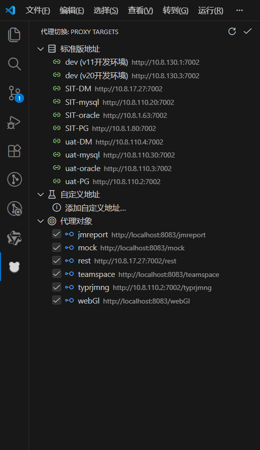

<!--
 * @Description: 
 * @Author: weig
 * @Date: 2026-01-09 12:52:46
-->
# Proxy URL Switcher

VSCode 插件，用于快速切换 `proxy-url-list*.json` 中的服务代理地址（保持原有路径不变，仅替换协议/主机/端口）。

## 功能特性

1. **侧边栏视图**：在左侧活动栏提供可视化的代理切换面板。
2. **多环境支持**：
   - **标准版地址**：通过 VS Code 设置中的 `proxyUrlSwitcher.profiles` 维护预设环境列表（支持添加/删除）。
   - **自定义地址**：在侧边栏直接添加临时测试地址（支持添加/删除，且会做重复校验）。
3. **精细控制**：
   - 可勾选/取消具体的代理对象（如 `rest`, `basic`, `ipd` 等），只更新选中的服务。
4. **一键应用**：点击地址项即可将 Host:Port 应用到勾选的代理对象中，保持原有路径不变。
5. **端口必填**：添加/应用地址时要求包含端口（例如 `10.8.150.33:7002`）。

## 使用方法

1. 打开包含 `proxy-url-list-new.json` 或 `proxy-url-list.json` 的工作区。
2. 点击左侧活动栏的“服务代理切换”图标。
3. 在“代理对象”分组中勾选需要修改的服务 key。
4. 点击“标准版地址”或“自定义地址”中的某一项，即可应用。

## 支持的配置文件

- 默认会在工作区中查找 `proxy-url-list-new.json` 与 `proxy-url-list.json`。
- 当工作区内存在多个匹配文件时：
  - 侧边栏视图优先读取 `proxy-url-list-new.json`
  - 执行“应用”时会弹出选择框，选择要更新的具体文件

## 配置项

- `proxyUrlSwitcher.fileGlob`: 查找 json 文件的 glob 模式（默认 `**/{proxy-url-list.json,proxy-url-list-new.json}`）。
- `proxyUrlSwitcher.profiles`: 预设环境列表，例如：
  ```json
  [
    { "name": "dev (开发环境)", "origin": "http://10.8.130.1:7002", "group": "dev" },
    { "name": "SIT-PG", "origin": "http://10.8.1.80:7002", "group": "SIT" },
    { "name": "uat-PG", "origin": "http://10.8.110.2:7002", "group": "UAT" }
  ]
  ```

## 源代码

- https://github.com/tony-wei1990/vscode-proxy-url-switch

## 打包安装

```bash
# 安装依赖（如果需要）
npm install -g @vscode/vsce

# 打包生成 .vsix
npm run package
```

打包成功后，会在项目根目录生成一个 `.vsix` 文件，文件名格式为：

- `proxy-url-switcher-<version>.vsix`（例如：`proxy-url-switcher-0.0.10.vsix`）

打包完成后的效果示例（示意）：

```text
D:\个人资料\vscode-proxy-url-switcher
├─ extension.js
├─ package.json
├─ README.md
├─ resources\
└─ proxy-url-switcher-0.0.10.vsix
```

命令行输出示例：

```text
DONE  Packaged: D:\个人资料\vscode-proxy-url-switcher\proxy-url-switcher-0.0.10.vsix
```

## 安装成功效果图


